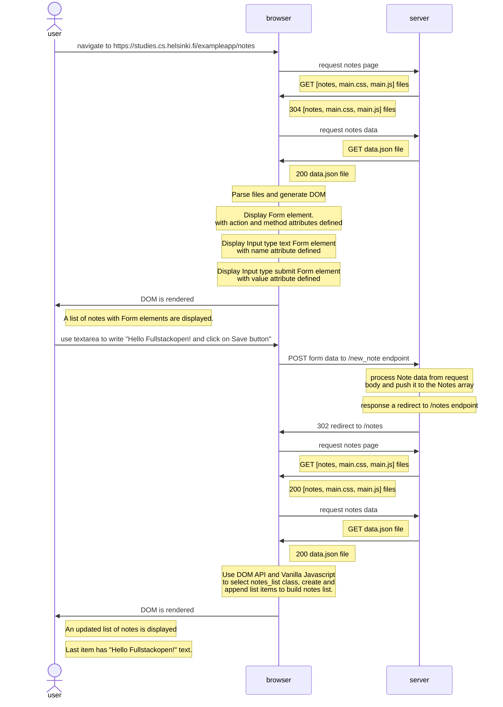

```mermaid
sequenceDiagram
    actor user
    user->>browser: navigate to https://studies.cs.helsinki.fi/exampleapp/notes
    participant server
    browser->>server: request notes page
    Note left of server: GET [notes, main.css, main.js] files
    server->>browser: 
    Note right of browser: 304 [notes, main.css, main.js] files
    browser->>server: request notes data
    Note left of server: GET data.json file
    server->>browser: 
    Note right of browser: 200 data.json file
    Note over browser: Parse files and generate DOM
    Note over browser: Display Form element.<br>with action and method attributes defined
    Note over browser: Display Input type text Form element<br> with name attribute defined
    Note over browser: Display Input type submit Form element<br> with value attribute defined
    browser->>user: DOM is rendered
    Note right of user: A list of notes with Form elements are displayed.
    user->>browser: use textarea to write "Hello Fullstackopen! and click on Save button"
    browser->>server: POST form data to /new_note endpoint
    Note over server: process Note data from request <br> body and push it to the Notes array 
    Note over server: response a redirect to /notes endpoint
    server->>browser: 302 redirect to /notes
    browser->>server: request notes page
    Note left of server: GET [notes, main.css, main.js] files
    server->>browser: 
    Note right of browser: 200 [notes, main.css, main.js] files
     browser->>server: request notes data
    Note left of server: GET data.json file
    server->>browser: 
    Note right of browser: 200 data.json file
    Note over browser: Use DOM API and Vanilla Javascript<br>to select notes_list class, create and<br>append list items to build notes list.
    browser->>user: DOM is rendered
    Note right of user: An updated list of notes is displayed
    Note right of user: Last item has "Hello Fullstackopen!" text.
```