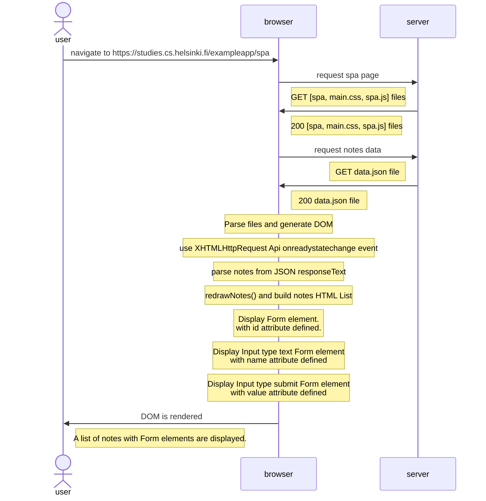

```mermaid
sequenceDiagram
    actor user
    user->>browser: navigate to https://studies.cs.helsinki.fi/exampleapp/spa
    participant server
    browser->>server: request spa page
    Note left of server: GET [spa, main.css, spa.js] files
    server->>browser: 
    Note right of browser: 200 [spa, main.css, spa.js] files
    browser->>server: request notes data
    Note left of server: GET data.json file
    server->>browser: 
    Note right of browser: 200 data.json file
    Note over browser: Parse files and generate DOM
    Note over browser: use XHTMLHttpRequest Api onreadystatechange event
    Note over browser: parse notes from JSON responseText
    Note over browser: redrawNotes() and build notes HTML List
    Note over browser: Display Form element.<br>with id attribute defined.
    Note over browser: Display Input type text Form element<br> with name attribute defined
    Note over browser: Display Input type submit Form element<br> with value attribute defined
    browser->>user: DOM is rendered
    Note right of user: A list of notes with Form elements are displayed.
```