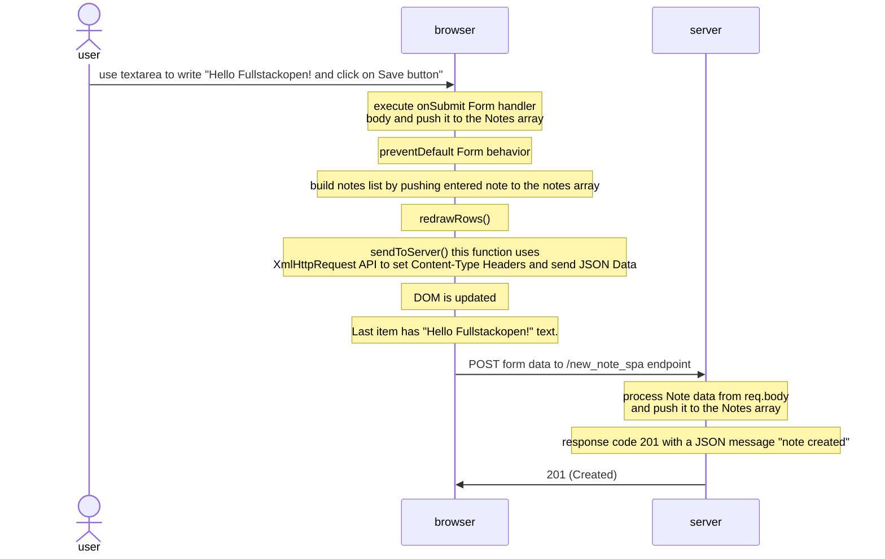

```mermaid
sequenceDiagram
    actor user
    user->>browser: use textarea to write "Hello Fullstackopen! and click on Save button"
    Note over browser: execute onSubmit Form handler <br> body and push it to the Notes array 
    Note over browser: preventDefault Form behavior 
    Note over browser: build notes list by pushing entered note to the notes array
    Note over browser: redrawRows()  
    Note over browser: sendToServer() this function uses<br> XmlHttpRequest API to set Content-Type Headers and send JSON Data
    Note over browser: DOM is updated
    Note over browser: Last item has "Hello Fullstackopen!" text.
    browser->>server: POST form data to /new_note_spa endpoint
    Note over server: process Note data from req.body <br> and push it to the Notes array 
    Note over server: response code 201 with a JSON message "note created" 
    server->>browser: 201 (Created)
```